### Zadanie 1. **Z jakim typem ataku DDoS mamy do czynienia?**

**Wireshark**
Zwykle przy atakach Distributed Denial of Service mamy do analizy mnóstwo pakietów. Nie jestesmy w stanie przeanalizować wszystkich pakietów ręcznie. Potrzebujemy zatem zobaczyć statystyki całego pliku pcap, który pomoże nam przeprowadzić „basic triage” z samych liczb.  
Tutaj przydadzą się dwie opcje – Statistics -> Protocol Hierarchy and Packet Lenghts.  

**Zerknijmy wpierw na Statistics - > Protocol Hierarchy:**  
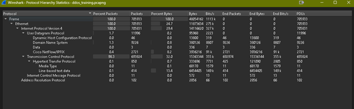
Widzimy że **98% ruchu stanowi TCP**, ale jednocześnie tylko bardzo mała część tego ruchu niesie dane z warstwy aplikacji, np. **HTTP**. To oznacza, że mamy bardzo dużo pakietów TCP, ale bez realnej komunikacji na wyższej warstwie. **Czyli urządzenia głównie próbują zestawiać połączenia,** a nie faktycznie wymieniają dane.  
  
Zerknijmy teraz na Packet Lenghts:  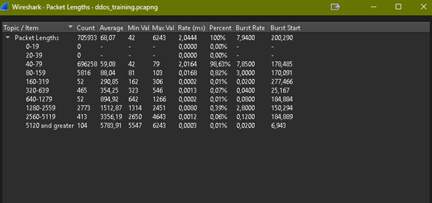

Co tutaj widzimy? Aż **98% pakietów** ma długość **40-79 bajtów**. Jest to ważna wskazówka, bo tak duży udział bardzo krótkich pakietów zwykle sugeruje ruch nietypowy. W normalnej komunikacji mielibyśmy raczej większe zróżnicowane, a tutaj widać wyraźną dominację małych pakietów.

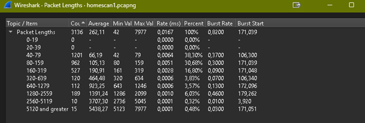
(wynik Packet Lenghts z mojego skanu dla porownania)**

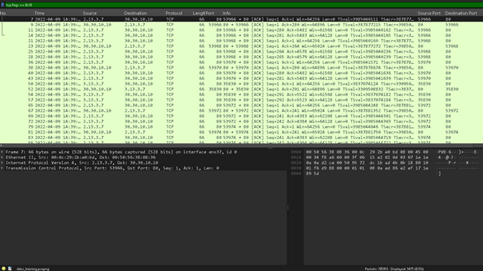
Możemy podejrzewać, że to jest jakiś atak DDoS. Skoro mieliśmy dominację ruchu TCP, możemy użyć filtru do flag TCP, np. **tcp.flags == 0x02. Mamy ich aż 332025** 

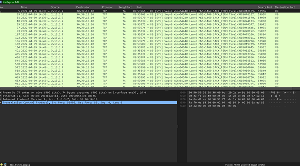
Sprawdzamy odpowiedzi: **tcp.flags == 0x10**. Mamy ich zdecydowanie mniej.
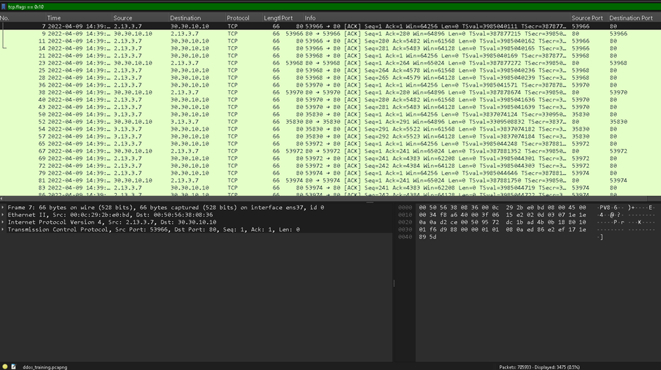
Sprawdzamy **flagi SYN/ACK - tcp.flags == 0x12**
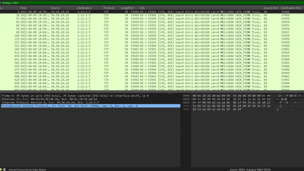

Pakietów mamy tutaj tyle, co we flagach **SYN.** Sugerować to może, że komunikacja docierała aż do nawiązywania połączenia ale z powodu dużej ilości zapytań, nie zawsze kończyła się prawidłowo. Dlatego mamy tak mało pakietów **ACK**.

Mamy przykład ataku, który nazywa się **SYN Flood** -  napastnik zasypuje cel ogromną liczbą żądań rozpoczęcia połączenia **(SYN, SYN/ACK).** Sęk w tym że nigdy „klient” nie odpowiada na komunikaty zwrotne, przez co połączenia nie są dokończane. Przy dużej ilości takiego ruchu atakujący może przeciążyć albo nawet wysypać serwer

**#### Netflow**  
Szybko ustalamy czy atak jest oparty na TCP, UDP, czy ICMP:  
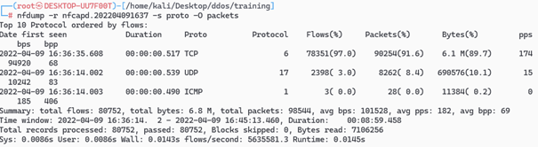
**Tak jak w Wiresharku, tutaj dominuje TCP.**  

Następnie sprawdzamy, ile łącznie połączeń występuje w analizowanym oknie czasu:  
  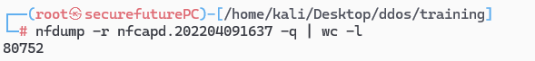

Teraz liczymy ruch związany z nawiązywanmi połączeniami TCP (rekordy SYN, SYN/ACK). Jeżeli takich rekordów jest bardzo dużo względem liczby wszystkich połączeń, to wskazuje to na „zalewanie” próbami zestawiania połączeń, czyli inaczej **SYN flood**.  
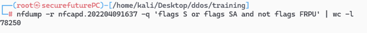

### Zadanie 2. **Podaj adresy IP, które brały udział w ataku?  
****Wireshark  
**Dobrą opcją do wyłapania adresów biorących w ataku będzie **Statistics - > IPv4 Statistics -> Sources and Destination Addresses.  
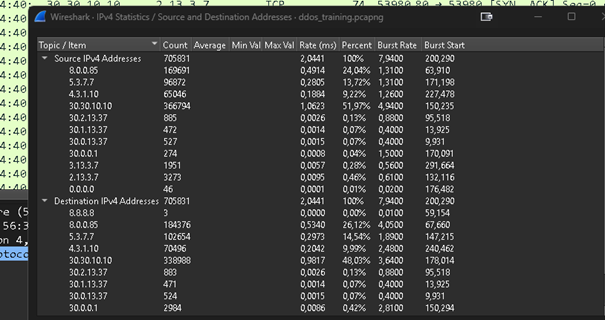

Następnie filtruję jak w poprzednim zadaniu na **flagi SYN**  
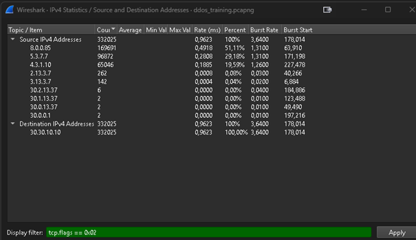
***Najczęściej (top3) przewijają się:***  
- *8.0.0.85 (51%)*  
- *5.3.7.7 (29%)*  
- *4.3.1.10 (19%)**
  
**Jeszcze jest alternatywa:  
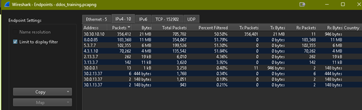
No ale tutaj mamy wszystko wsadzone do jednego worka i nie jesteśmy w 100% stwierdzić które IP są tymi atakującymi.
 
#### **Netflow**  

Sprawdzimy to komendą: 
**nfdump -r nfcapd.202204091637 -s srcip -O packets 'flags S and not flags AFRPU'**  
-r –** odczyt wskazanego pliku**-s scrip –** statystyka na bazie źródłowergo adresu IP  
**-O packets** – sortowanie wyniku po liczbie pakietów  
- **'flags S and not flags AFRPU'** – ograniczenie analizy do ruchu odpowiadającego próbom rozpoczęcia połączenia tcp
  
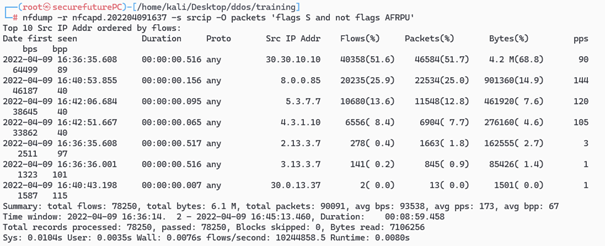

**Mamy te same IP co w Wiresharku:  
8.0.0.85 (25.9%)  
5.3.7.7 (13.6%)  
4.3.1.10 (8.4%)**

## Zadanie 3. **Czy możemy stwierdzić, że adresy z pkt. 2 to prawdziwe adresy atakujących?  
**(Note: w pytaniu chyba chodziło o pkt.2  a nie o 4)

Sprawdźmy adresy z zadania 2 filtrem **ip.src + not tcp.flags == 0x02 (pokazuje cały ruch adresów oprócz pakietów SYN)**  
Możemy od razu zastosować je do 3 IP z zadania 2.  
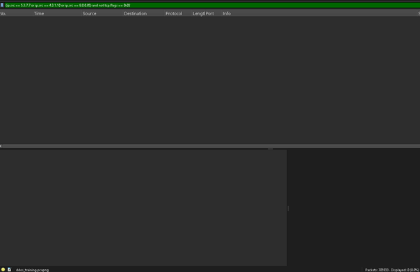

Jeszcze to samo ale dla potwierdzenia jeżeli chodzi **o flagi SYN:**  
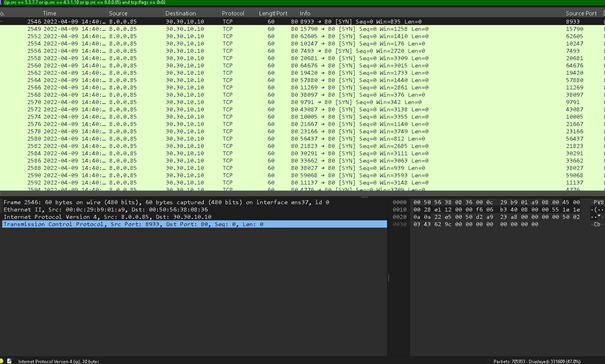
**Jak widać nie ma żadnej komunikacji - sygnał ostrzegawczy, bo w normalnym połączeniu po wysłaniu pakietu SYN są kolejne etapy 3-way handshake.  
  
Teraz sprawdzę odpowiedzi ofiary – w poprzednim zadaniu widać destination address **30.30.10.10**  
Filtr: **ip.src == 30.30.10.10 and tcp.flags == 0x12** – bo sprawdzamy SYN ACK wysyłany przez ofiarę:  
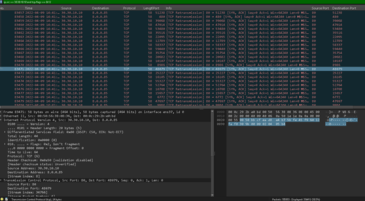
**Dużo retransmisji = są wysyłane ponownie = ofiara stara się odpowiadać ale nie dostaje odpowiedzi.  
  
Odp:** możemy zakładać, że adresy zostały zespoofowane.  
Normalna komunikacja zwykle objawia się normalną wymianą host-serwer. Brak odpowiedzi na SYN/ACK sugeruje spoofing adresu IP. Gdyby adres źródłowy był prawdziwy ten prawdziwy host powinien dokończyć handshake. Skoro tego nie robi to prawdopodobnie adres został podszyty. 

## Zadanie 4. **Podaj datę i czas (UTC) pierwszego i ostatniego pakietu w ataku**

Filter: (**ip.src == 8.0.0.85 or ip.src == 5.3.7.7 or ip.src == 4.3.1.10) and tcp.flags == 0x02**

Pamiętajmy, że sprawdzamy tylko IP DESTINATION! **jeżeli się pojawiły inne TCP Errors z podejrzanych IP po ataku, zwykle są to retransmisje – nie biorą udziału w ataku**

Pierwszy pakiet: **2546   2022-04-09 14:40:53**  
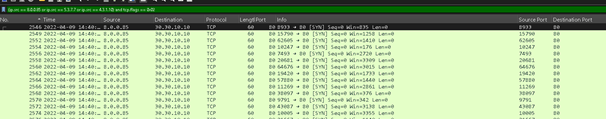
Ostatni pakiet: **700357 2022-04-09 14:43:56**
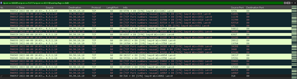

## Zadanie 5. **Stwórz wykres natężenia ataku**  

**Netflow**

W Netflow nie ma takiego narzędzia, jak w Wiresharku. Za to możemy przekonwertować nfcapd do csv i potem wykres zrobić w Excelu. Zrobimy to komendą:  
**nfdump -r nfcapd.202204091637 -q -o "csv:%ts,%te,%td,%sa,%da,%sp,%dp,%pr,%flg,%fwd,%stos,%ipkt,%ibyt,%opkt,%obyt,%in,%out,%sas,%das,%smk,%dmk,%dtos,%dir,%nh,%nhb,%svln,%dvln,%ismc,%odmc,%idmc,%osmc,%mpls1,%mpls2,%mpls3" > training.csv**  
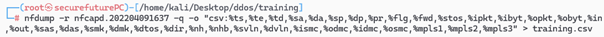
  
Z braku Excela, nie byłem w stanie tego zadania wykonać.  

**Jak to zrobić w skrócie:  
1. Otwieramy Excela  
2. Konwertujemy Tekst jako Kolumny - > Przecinek  
3. Tworzymy tabelę przestawną Pivot  
4. Odznaczamy:
**scrAddr w Kolumnach (nasze adresy atakujących)  
lastSeen – czas kiedy pakiet był widziany ostatnio  
inPackets – pakiety ingoing (przychodzące)**
5. Dla dobrego widoku robimy wykres. Powinno bardzo podobnie jak w Wiresharku.

#### **Wireshark**
Do tego użyjemy opcji **Statstics - > I/O Graph.** Filtrujemy IP’kami które brały udział w ataku **ip.addr == (IP ATAKUJĄCEGO) && ip.addr == (IP OFIARY)**
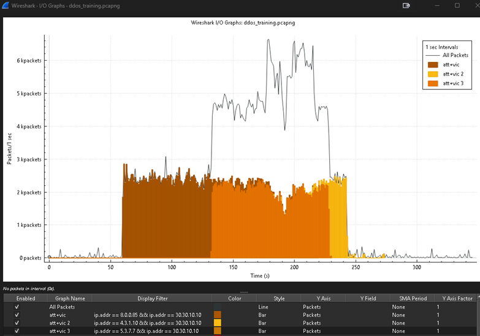

  
## Bonus 1. **Spróbuj określić realne adresy, które być może stały za atakiem.  
  
Szukamy zatem argumentów które nam przefiltrują adresy atakujące i te które które wykonywały inne zapytania np. http. podczas SYN floodu  
**Zbierzmy zatem listę klientów: Statistics - > Endpoints.** Naniesiemy to na graf by zobaczyć czy w trakcie ataku będą mogły wykonywać połączenia:  
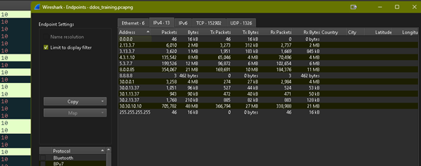
Eliminując IP ofiary i atakujących, (oraz takie jak 8.8.8.8 (google DNS), 255.255.255.255 (adres broadcast) oraz 0.0.0.0(adres specjalny, może do konfiguracji?) mamy:  
**2.13.3.7 3.13.3.7 30.0.0.1 30.0.13.37 30.1.13.37 30.2.13.37.  
Następnie  dodajemy je do naszego grafu:
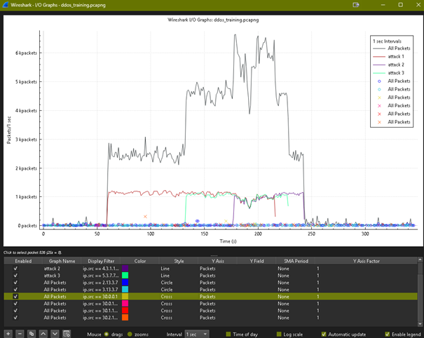
Mamy więc wszystkie adresy na grafie.
**2.13.3.7 3.13.3.7 30.2.13.37 30.0.0.1 –** wykonywały połączenia http w trakcie ataku, więc to raczej nie IP atakujące  
**30.0.13.37 30.1.13.37 –** wykonywały połączenia po i przed atakiem

**Odp. To raczej nie daje nam 100% gawrancji że te IP stały za atakiem.**

## Bonus 2. **Odpowiedz czy atak się udał czy nie? W jaki sposób możemy to określić? Czy możemy mieć pewność?  

  
Po tym grafie nie jesteśmy w stanie stwierdzić jednoznacznie, że atak był 100% pomyślny.
Możemy sprawdzić w jakim momencie serwer nie odpowiadał (brak pakietów zwrotnych
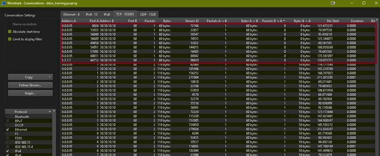
  
Są to połączenia z naszych „podejrzanych” czyli atakujących IP. Więc nie są to połączenia z klientami, tylko z tymi od atakujących. **Jeżeli byśmy mieli odrzucone pakiety od klientów (2.13.3.7 3.13.3.7 30.2.13.37 itd.) byśmy mogli sądzić, że serwer był „zawieszony” w czasie ataku.**

Tak jak widzieliśmy wcześniej na grafie, był jakiś ruch w czasie ataku przez co możemy sądzić że atak nie powiódł się całkowicie.