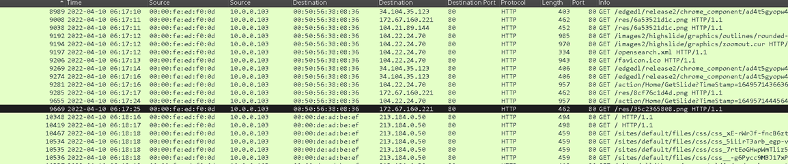
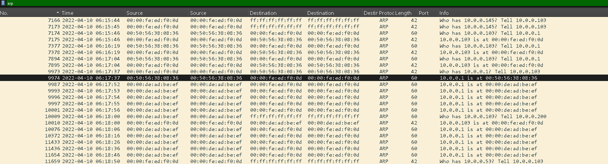
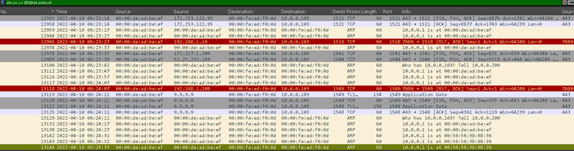
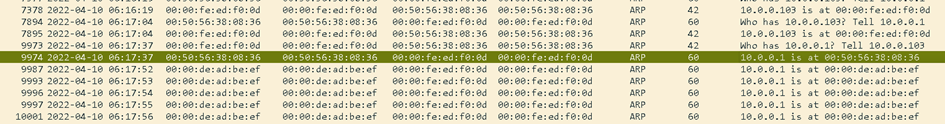
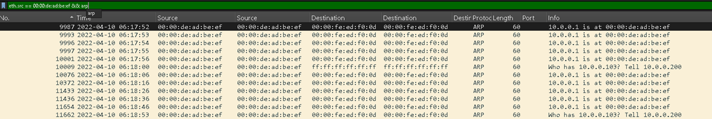
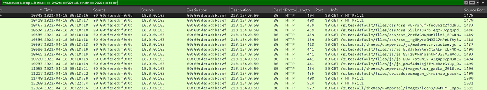
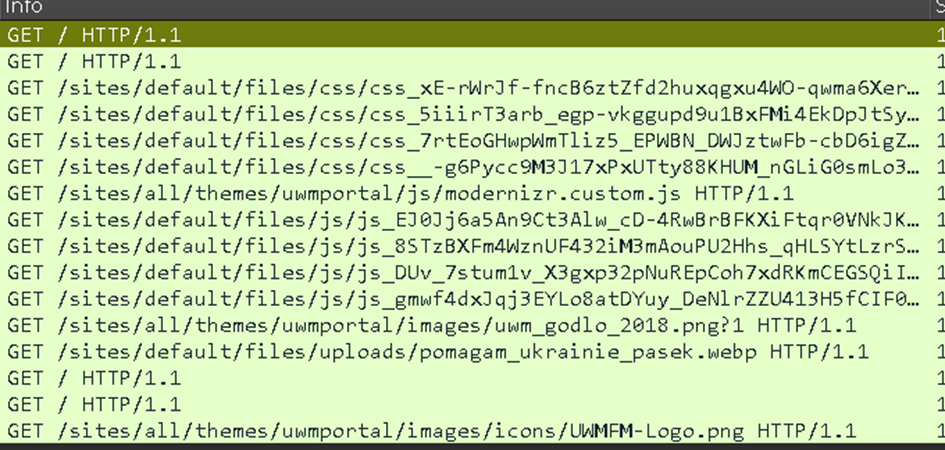
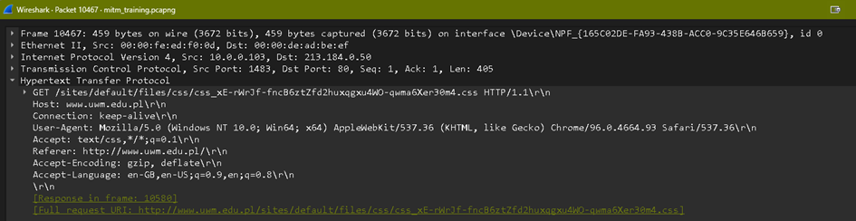
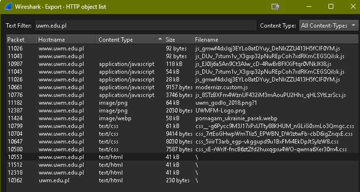
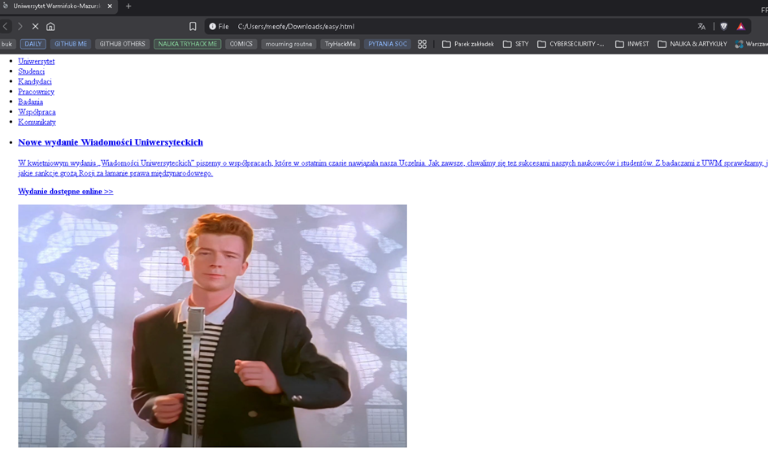

## Zadanie 1 - Jaki atak został przeprowadzony?

Warto tutaj zacząć od Statistics - > Protocol Hierarchy. Szybka obserwacja których typów ruchu jest najwięcej:  

**TLS (20%), QUIC (20%), http (0.5%).**  
QUIC to nowy szyfrowany protokół warstwy transportowej. QUIC został zdesignowany tak by ruch HTTP był bezpieczniejszy i wydajniejszy.

Możemy więc prześledzić ruch HTTP, który można odczytać bezpośrednio:  
**tcp && http.request** .

W ten sposób odfiltrujemy dużo niepotrzebnych w analizie pakietów, i będziemy mogli się skupić na zapytaniach GET, POST itd.

Na razie nic nie widać – przynajmniej póki nie skupimy się na adresach MAC.  
  

  
Tutaj widzimy coś nietypowego – jeden adres IP z dwoma adresami MAC! Widać że większość ruchu HTTP wychodzi do MAC 00:50:56:38:08:36, ale trafia do MAC 00:00:de:ad:be:ef.  
Zmiana adresu MAC odbywa się w krótkim odstępie czasu, jest to nietypowe zachowanie bo host nie wysyła pakietów do prawidłowego MAC. Może to świadczyć o ataku MiTM.  
  
**Upewniamy się sprawdzając całą komunikację z 00:00:de:ad:be:ef.**

**eth.addr == 00:00:de:ad:be:ef**

Jak widzimy, nasz podejrzany dopiero koło pakietu 9987 „przechwycił komunikację” i zmienił adres MAC na swój. **10.0.0.1 is at 00:00:de:ad:be:ef.  
  
**Może to świadczyć o ARP Spoofingu. Musimy więc potwierdzić naszą teorię filtrem arp**:  
 

Dokładnie 9987: wcześniej 10.0.0.103 był 00:00:fe:ed:f0:0d a potem:  

**Who has 10.0.0.1?** **Tell 10.0.0.103 - 10.0.0.1 is at 00:00:de:ad:be:ef.  

**Atakujący rozsyła nieprawdziwą informację że: „adres IP bramy 10.0.0.1 jest mój”. Nadpisuje tym tablice ARP. W ten sposób ruch trafia do niego zamiast do prawdziwej bramy.

Odp. Przeprowadzono atak **ARP Spoofing**

## Zadanie 2 - **Jaki protokół został wykorzystany do przeprowadzenia ataku?**

Odp. Bazując na analizie z zadania 1 - **jest to protokół ARP**  

## Zadanie 3 - **Podaj datę i czas (UTC) początku i końca ataku  

**Odfiltrowujemy adres atakującego - eth.src == 00:00:de:ad:be:ef**  

**9985     2022-04-10 06:17:52**
00:00:de:ad:be:ef           10.0.0.1              00:00:fe:ed:f0:0d            10.0.0.103                        
ICMP     60                          
Echo (ping) request  id=0x7ee7, seq=32487/59262, ttl=64 (reply in 9986)              
  
**13144  2022-04-10 06:24:33**     
00:00:de:ad:be:ef           00:00:de:ad:be:ef           00:00:fe:ed:f0:0d               00:00:fe:ed:f0:0d                            
ARP       60                          
10.0.0.1 is at 00:50:56:38:08:36  
  

## Zadanie 4 - **Jaki był adres MAC atakującego?  

**Szukamy pakietów, w których jakiś MAC ogłasza się jako właściciel IP 10.0.0.1.**

**00:00:de:ad:be:ef**  

## Zadanie 5 - **Jaki był adres MAC ofiary?**

Szukamy hosta który został „nadpisany” w tablicy ARP i do którego były przekierwoywane odpowiedzi:  
  

  
**00:00:fe:ed:f0:0d**

## Zadanie 6 - Jaką stronę odwiedziła ofiara?

Szukamy ruch http ofiary który podczas ataku przechodził przez atakującego.

**http request && tcp** – szukamy żądań http  
**eth.src == 00:00:fe:ed:f0:0d** – pakiety które wyszły od ofiary  
**eth.dst == 00:00:de:ad:be:ef** – pakiety przeszły przez atakującego (trafiły do atakującego na poziomie ramki Ethernet)

**Odp.** www.uwm.edu.pl

## Zadanie 7 - Czy strona używała szyfrowanego połączenia?

**Na screenie z pkt. 8 widać że nie ma przekierowań na HTTPS – wszystko się dzieje na protokole 80 czyli http.**

## Zadanie 8 -  Ściągnij wyeksportowaną wersje strony odwiedzonej przez ofiarę

**File - > Export Objects -> http -> Text filter: uwm.edu.pl -> Save As**
## Zadanie 9 - Co stało się podczas ładowania strony?

Kolejny Rick and Roll 😊

