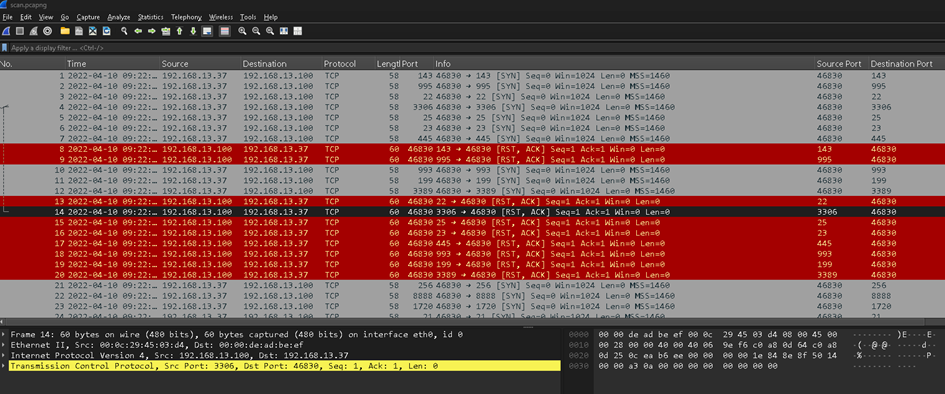
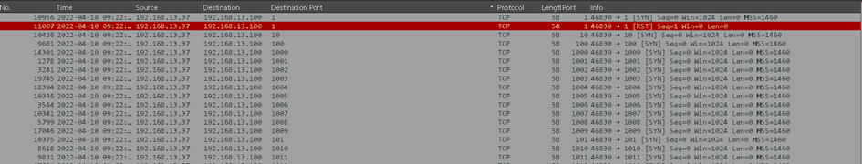
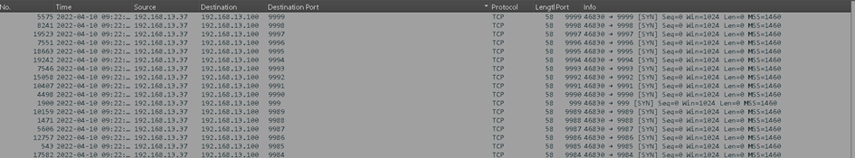
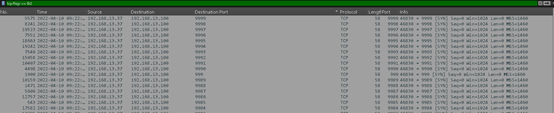
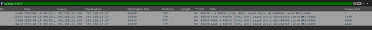
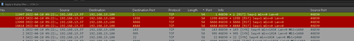
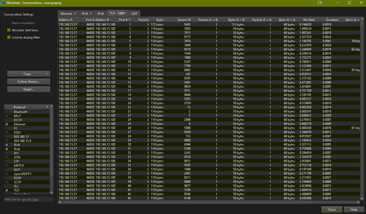
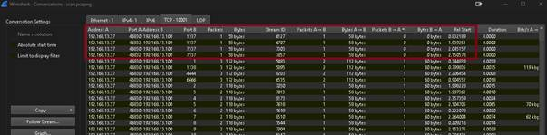

# Skanowanie sieci

## Zadanie 1 - Jaki rodzaj skany został użyty?

Na pierwszy rzut oka od razu jesteśmy w stanie zauważyć (bez nawet żadnych filtrów) że te skany się opierają na 3-way handshake (pełno SYN, RST/ACK). Filtrując po **Destination Port** możemy sprawdzić, że wszystko to się tyczy innych portów (zakres 0-9999)

Jest to typowy wzorzec dla **skanu SYN**, (**half-open scan**)

## Zadanie 2. Podaj IP skanera

**tcp.flags == 0x2 - odfiltrowujemy pakiety SYN**

**Atakujący: 192.168.13.37**

## Zadanie 3. Podaj IP skanowanej maszyny

Jak wyżej na screenie, destination - **192.168.13.100**      

**Zadanie 4. Jakie porty były otwarte?**  
Odfiltrowujemy flagi SYN/ACK (tam gdzie **host odpowiedział SYN/ACK, port jest otwarty**): **tcp.flags == 0x12**  

NOTE: Metoda pośrednia: Przy skanach, tam gdzie jest otwarty port, możemy zaobserwować że zwykle lekko się różnią długościami pakietów. To **ślad po udanej odpowiedzi (RST od skanera)**, dowód jest pośredni. Odfiltrowując je:  

**4444, 6666, 1338, 1**

## Zadanie 5. Jakie porty były odfiltrowane?

By ustalić które porty były odfiltrowane, sprawdzamy na które próby połączenia host docelowy w ogóle odpowiedział:  
**Statistics → Conversations → TCP**

Następnie filtrujemy tak jak w ataku DDoS - > Pakiety B do A  

**Odp. 1337 i 7337  
NOTE:** Niektóre porty pojawiają się w skanie więcej niż raz. Jest to naturalne, bo gdy skaner nie dostaje odpowiedzi to często ponawia próbę. Robi to po to zeby „upewnić się” że brak odpowiedzi rzeczywiście wynika z filtrowania a nie z chwilowego problemu z transmisją.
