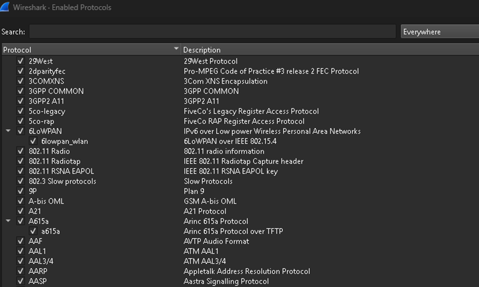

# WIRESHARK

W tym folderze znajduje się pierwsze zadanie z Wiresharka. Plik zawiera wprowadzenie do Wiresharka, jak i zadanie ze Szkoły Security - Security Analyst - Podstawy z Sieci - wireshark.pcap

## Zadanie
[Enter](/courses/szkola-security/sieć/powtorka-z-sieci/zadania/wireshark/wireshark-podstawy/wireshark.pcapng-analysis.md)

## Pytania z kursu
1. Zidentyfikuj 3-way handshake w pakietach TCP
2. Jaki protokół warstwy aplikacyjnej został użyty
3. Jaki użytkownik i hasło zostało użyte do zalogowania
4. Bonus: wyeksportuj przesłany dokument i sprawdź co jest w środku

## **Czym w ogóle jest Wireshark? Do czego służy i jakie funkcje tego narzędzia najbardziej przydają w pracy analityka?**  
  
**Wireshark** według mnie to jedno z najpopularniejszych narzędzi do analizy ruchu sieciowego. Oczywiście mamy alternatywy, jak Network Miner (jeżeli chodzi program z GUI, nie program konsolowy) i też znane konsolowe programy do analizy jak tcpdump i tshark (których użyję w innych zadaniach). Mówiąc prościej — pozwala nam podejrzeć, co dokładnie dzieje się w komunikacji między urządzeniami w sieci. Możemy zobaczyć pojedyncze pakiety, sprawdzić, jakie dane są przesyłane, i przeanalizować cały przebieg komunikacji krok po kroku.  
  
Oczywiście, żeby korzystanie z tego narzędzia miało sens, dobrze jest znać przynajmniej podstawy sieci komputerowych. Bez tego da się coś zauważyć, ale dużo trudniej zrozumieć, co właściwie widzimy i dlaczego dany ruch wygląda właśnie tak, a nie inaczej.  
  
W Wiresharku kluczowe jest filtrowanie ruchu, bo bez tego analiza większego zrzutu szybko robi się niepraktyczna. Zamiast przeglądać cały capture, zawężasz widok do konkretnych hostów, portów, protokołów albo typów zdarzeń i od razu pracujesz na tym, co ma znaczenie.

**Druga istotna rzecz to analiza per protokół.** Dzięki temu widać, które warstwy biorą udział w komunikacji, gdzie kończy się jeden etap wymiany i zaczyna następny, a także na którym poziomie pojawia się problem.

**Do tego dochodzi śledzenie całych strumieni i konwersacji.** To pozwala analizować komunikację jako ciąg zależnych od siebie pakietów, a nie zbiór pojedynczych ramek. W praktyce to właśnie tutaj najlepiej widać kontekst sesji, sekwencję żądań i odpowiedzi oraz moment, w którym coś przestaje działać.  
Jest to oczywiście kropla w morzu funkcjonalności Wiresharka, ale na potrzeby wstępnej analizy ruchu sieciowego już te opcje wystarczają, by zobaczyć, jak dużo informacji można wydobyć z pozornie zwykłego przechwycenia pakietów. 

## **Optymalizacja Wiresharka**

Na początku warto ustawić Wiresharka tak, żeby analiza była czytelna i spójna.  
Wyłączam **name resolution**, żeby program nie zamieniał adresów na nazwy hostów. Dzięki temu od razu widać surowe adresy IP i nie dochodzą dodatkowe, często mylące, opisy.  
Czas ustawiam na **UTC**, bo wtedy timestampy są spójne i łatwiej je porównywać z innymi źródłami, zwłaszcza z logami. Ma to znaczenie szczególnie przy większych zrzutach i w środowiskach, gdzie różne systemy pracują w różnych strefach czasowych.  
  
Dostosowuję też kolumny do tego, co analizuję. Przy konkretnych przypadkach warto dodać pola zależne od typu ruchu, na przykład przy analizie SYN flood sens mają kolumny związane z flagami TCP, a przy ICMP przydaje się typ i kod komunikatu. Zwykle wystarczają te kolumny:

- numer pakietu,  
- czas,  
- source,  
- destination,  
- protocol,  
- length,  
- info.  
  
## Opcje Wiresharka

**a) File**

Z tego menu w praktyce najczęściej przydają się dwie rzeczy:  
**Export Objects** - Pozwala wyodrębnić pliki przesyłane w ruchu sieciowym, na przykład przez HTTP, SMB albo FTP. Dzięki temu nie kończymy analizy na samych pakietach — można odzyskać faktycznie przesyłany obiekt, np. dokument albo inny plik.

**Merge** służy do łączenia kilku plików capture w jeden. To przydaje się wtedy, gdy ruch został zapisany w kilku osobnych plikach, a chcemy analizować go jako całość.

---

**b) Statistics**

Menu **Statistics** w Wiresharku pomaga najpierw zrozumieć ogólny charakter ruchu, a dopiero potem wejść w analizę technicznych szczegółów.  
Opcja **Protocol Hierarchy** pokazuje, jakie protokoły występują w zrzucie oraz jak duży udział mają w całym ruchu. W praktyce pozwala to szybko ocenić, czy analizowany materiał dotyczy głównie np. przeglądania stron WWW, zapytań DNS, komunikacji plikowej SMB czy innego typu aktywności. Zamiast ręcznie przeglądać setki lub tysiące pakietów, od razu dostajemy uporządkowany obraz całego ruchu.  
**Conversations** i **Endpoints** pomagają ustalić, kto z kim się komunikował oraz które adresy lub połączenia były najbardziej aktywne. Różnica jest taka, że **Conversations** skupia się na ruchu między dwiema stronami, a **Endpoints** pokazuje statystyki dla poszczególnych hostów lub adresów. Dzięki temu można szybko wytypować najważniejsze połączenia i hosty, które warto przeanalizować dokładniej.  
**Capture File Properties** prezentuje podstawowe informacje o samym pliku przechwycenia, takie jak liczba pakietów czy ogólne dane o capture file.  
To dobry punkt startowy, gdy chcemy zrozumieć skalę materiału, z którym pracujemy.  
**I/O Graphs** pozwala zobaczyć ruch na wykresie w czasie, co ułatwia wychwycenie nagłych wzrostów ruchu, większych transferów albo nietypowych momentów aktywności.

---

**c) View, Go, Capture**

Opcja **View** w Wireshark służy głównie do dostosowania sposobu wyświetlania interfejsu i pakietów: można w nim pokazywać lub ukrywać paski narzędzi, statusbar oraz panele takie jak lista pakietów, szczegóły pakietu itd. **Umożliwia też zmianę formatu czasu wyświetlania znaczników czasowych**, w tym daty i czasu od początku przechwytywania czy od poprzedniego pakietu. Ogólnie **View** umożliwia wygodniejszą analizę pakietów – powiększać i zmniejszać widok, rozwijać drzewa szczegółów, kolorować listę pakietów i konwersacje itd.  
  
Opcja **Go** w Wireshark służy głównie do szybkiej nawigacji po pakietach w przechwyconym ruchu. Pozwala cofać się i przechodzić dalej po historii wcześniej odwiedzonych pakietów, podobnie jak w przeglądarce, a także od razu przejść do konkretnego pakietu po jego numerze. To menu umożliwia też wygodne przemieszczanie się po liście pakietów: do poprzedniego i następnego pakietu, a także bezpośrednio do pierwszego lub ostatniego pakietu w pliku przechwytywania. Dodatkowo można przejść do pakietu odpowiadającego aktualnie wybranemu polu protokołu, na przykład z żądania do odpowiedzi. Istotną funkcją są również opcje przechodzenia do poprzedniego i następnego pakietu w ramach tej samej konwersacji, co ułatwia analizę pojedynczej sesji komunikacyjnej.

**Capture** w Wireshark służy do zarządzania przechwytywaniem pakietów. W pracy analityka zwykle nie korzystamy z live captions, operujemy na gotowych data setach.

---

**d) Analyze**

**Analyze** w Wireshark służy przede wszystkim do łatwiejszego rozumienia tego, co widać w przechwyconym ruchu sieciowym. Pozwala tworzyć i zapisywać filtry wyświetlania, dzięki którym można szybko ukryć niepotrzebne pakiety i skupić się tylko na interesujących danych. Umożliwia też budowanie filtrów z gotowych pól, bez konieczności pamiętania całej składni.  
  
Bardzo przydatna funkcja to **Follow TCP Stream albo ogólnie Follow Stream**, bo pozwala podejrzeć całą rozmowę w ramach jednego strumienia. Dzięki temu łatwiej zobaczyć, „kto z kim rozmawia” i co dokładnie jest przesyłane.

**Enabled Protocols** pozwala sprawdzić, jakie protokoły Wireshark interpretuje i ewentualnie to zmienić. 

**Expert Information** zbiera ostrzeżenia, nietypowe zdarzenia i rzeczy, które mogą od razu zwrócić uwagę podczas analizy.  

**- Chat (niebieski)** Informacje o typowym przebiegu działania, np. pakiet TCP z ustawioną flagą SYN.

**- Uwaga (cyjan) Istotne** zdarzenia, np. aplikacja zwróciła typowy kod błędu, taki jak HTTP 404.

**- Ostrzeżenie (żółty)** Ostrzeżenia, np. aplikacja zwróciła nietypowy błąd, taki jak problem z - połączeniem.

**- Błąd (czerwony)** Poważne problemy, np. uszkodzone lub nieprawidłowe pakiety.

https://www.wireshark.org/docs/wsug_html_chunked/ChAdvExpert.html

---

**e) Krótkie omówienie filtrów**

W zakładce **Analyze - > Display Filters** możemy opisać filtry i zapisać je do łatwiejszego wyszukiwania.  
Wchodząc w **Analyze -> Display Filter Expression**, możemy ręcznie wyszukać interesujące nas filtry, wraz z opisem.  
Warto też wiedzieć kilka najważniejszych filtrów, do szybkiego wyszukiwania.

- **tcp.flags** — flagi pakietów TCP
- **ip.addr** == 192.168.0.1 - Filtruje ruch dla konkretnego adresu IP, gdy chcemy sprawdzić, z kim komunikuje się podejrzana maszyna albo przeanalizować połączenie między naszym komputerem a konkretnym serwerem.
- **tcp.stream eq 0** — pokazuje jeden konkretny strumień (czyli rozmowę) TCP ułatwiając analizę (wszystko w jednym miejscu)
- **tcp.port == 80** – wyłapywanie stron które nie używają HTTPS. Zmieniając ten port, możemy przefiltrować ataki, np. 53 – dns (szukając DNS tunnelingu)
- **ip.src** == ... — filtr po adresie źródłowym (kto wysłał pakiet)
- **ip.dst** == ... — filtr po adresie docelowym (do kogo pakiet idzie)
- **eth.addr** == ... — filtr po adresie MAC
- **icmp** – wyszukiwanie zapytań ping, które pokazują atak ICMP flood
- **arp** — tylko ruch ARP, czyli pokazuje ruch, w którym urządzenia w sieci lokalnej „pytają”, **kto ma dany adres IP**.
- **http** — tylko ruch http, czyli ruch związany z komunikacją z serwerem WWW, czyli na przykład otwieraniem stron albo wysyłaniem danych.

Do tego dochodzą operatory porównania i logiczne, na przykład:

- == - przykł. ip.src == 10.0.0.5
- != - do wykluczenia np. ip.src != 10.0.0.5 (wszystkie oprócz 10.0.0.5)
- **&&** - oraz np. ip.src==10.0.0.5 and tcp.flags.fin
- **|| -** albo np. ip.src==10.0.0.5 or ip.src==192.1.1.1

Czyli można robić bardziej precyzyjne zapytania, na przykład zawężać ruch do konkretnego hosta i konkretnego protokołu jednocześnie.

---
