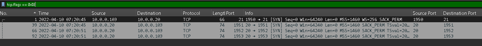
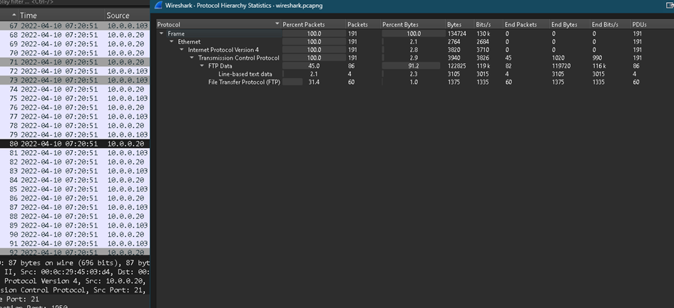
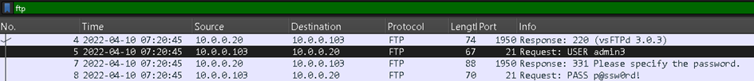
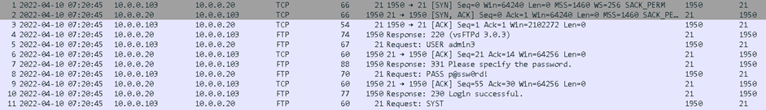
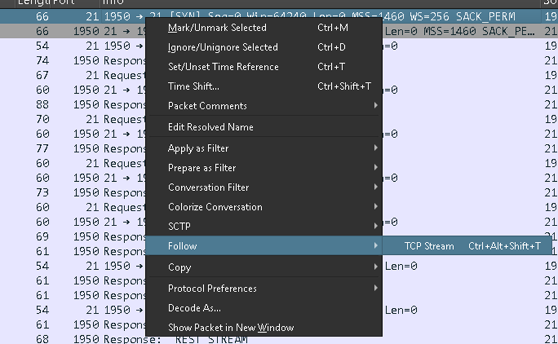
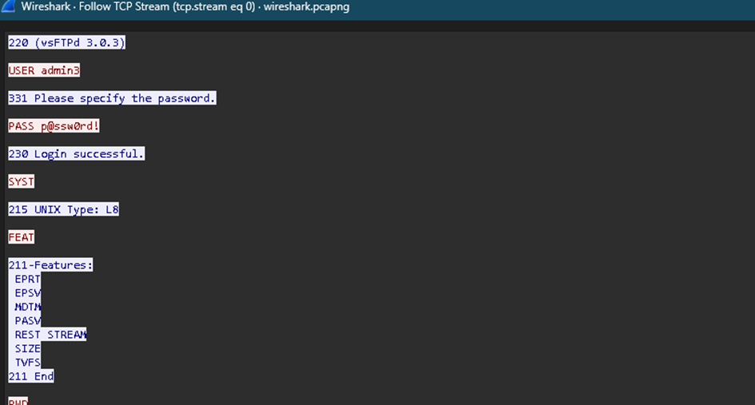
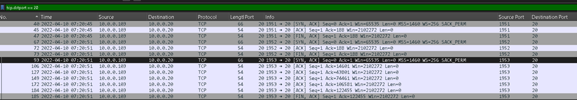
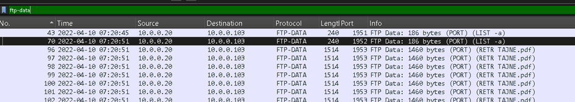
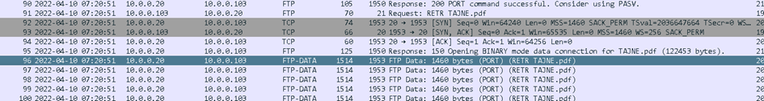
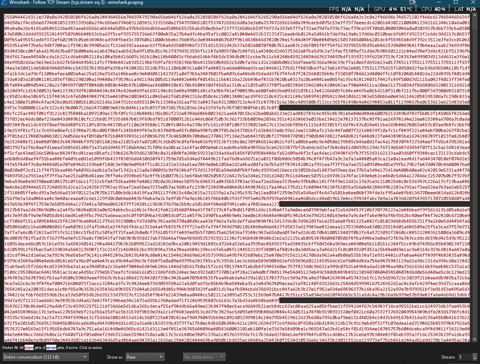

**1. Zadanie 1 – Zidentyfikuj 3-way handshake w pakietach TCP**  
  
3-way handshake jest to sposób zestawiania połączenia TCP między klientem i serwerem.

**3-way handshake w skrócie:**

1. klient wysyła SYN,
2. serwer odpowiada SYN/ACK,
3. klient odsyła ACK.

**_Są jeszcze inne flagi, jak FIN (koniec danych do nadawcy) RST (pojawia się przy ponownym zestawiania połączenia, zwykle po utracie połączenia)_**

W analizie pakietów najłatwiej znaleźć to po flagach TCP.  
Mogę zacząć od filtrowania pakietów SYN, na przykład przez **tcp.flags == 0x02**, a potem sprawdzić kolejne pakiety w tej samej rozmowie.  

Tutaj celem jest znalezienie poprawnej sekwencji SYN -> SYN/ACK -> ACK.

**0x02** – SYN**, 0x10** – ACK**, 0x12 (0x10 + 0x02)** – SYN/ACK

---

**2. Zadanie 2 – Jaki protokół warstwy aplikacyjnej został użyty?**

Warto to sprawdzać, ponieważ protokół warstwy aplikacyjnej pokazuje, jaki typ komunikacji faktycznie zachodził. Rozpoznajemy przez to czy był to na przykład ruch HTTP, FTP, DNS itd.  
  
**- Statistics -> Protocol Hierarchy.**  

---

**3. Zadanie 3 – Jaki użytkownik i hasło zostało użyte do zalogowania?**

Mamy tutaj „posortowany” (taki ładny) plik .pcap, gdzie wszystko widzimy od razu: w pakiecie 5 widać jasno REQUEST: USER admin3 i REQUEST PASS p@ssw0rd!  
Jednak w dużej analizie plików, trzeba najpierw przefiltrować konwersację filtrem **ftp**  

używać filtra tcp.stream eq 0 na pierwszym pakiecie interesującej nas konwersacji

**lub też Follow -> TCP Stream**  

  
W prawdziwych przykładach nie jest tak prosto, zwykle te dane są zaszyfrowane.

---

**4. Zadanie 4 BONUS – wyeksportuj przesłany dokument i sprawdź co jest w środku**

  
W tym pcapie na pierwszy rzut oka rzuca się FTP i FTP-DATA z nazwą pliku TAJNE.pdf  
**FTP Request** nie zawiera samego pliku to tylko komenda na połączeniu sterującym FTP.  
**FTP-DATA** to pakiety które zawierają bajty pliku.  
  
FTP zwykle operuje na portach 20 (od transferu danych) oraz 21 (służy do wysyłania komend, czyli sterowania połączeniem). FTP jest nieszyfrowany, także wszystkie dane widać w „plaintext” (jawnym tekscie). Są też szyfrowane alternatywy takie jak SFTP na porcie 22 i FTPS na porcie 989 i 990. Przy analizie dobrze wiedzieć, czy patrzymy na kanał sterujący, czy już na przesyłany plik. Możemy to przefiltrować tcp.dstport (==20 albo ==21). Tutaj nas interesuje port 20 (no bo transfer danych nas interesuje). Możemy też użyć filtru **ftp-data** żeby przefiltrować wszystkie pakiety które zawierają bajty pliku.  

**Zwracamy uwagę na:**
a)       większe rozmiary pakietów,
b)      opisy w kolumnie Info,
c)       komendy sugerujące przesyłanie pliku,
d)      nazwy plików, zwłaszcza z rozszerzeniami typu .txt, .pdf i podobnymi.

Po znalezieniu właściwego pakietu wykonujemy:  
1.  **Follow -> TCP Stream**2.  Ustawić **Show data as Raw**  
2. Zapisujemy zawartość przez **Save as**  

  
Możesz też użyć **Export Objects → FTP-DATA**, jeśli Wireshark dobrze złoży ten transfer.

Nie zawsze warto robić to od razu. Najpierw lepiej sprawdzić kontekst: który strumień odpowiada za interesujący Cię plik, czy to na pewno ten transfer i co faktycznie było pobierane. Dopiero potem ma sens eksport.

Przy większej liczbie plików albo bardziej mieszanym ruchu, np. z HTTP i zasobami typu obrazki, skrypty czy inne obiekty strony, taki eksport bez weryfikacji zwróci dużo rzeczy naraz. Da się to potem przeszukać, ale zwykle to tylko dokłada roboty.

**Efekt:**

